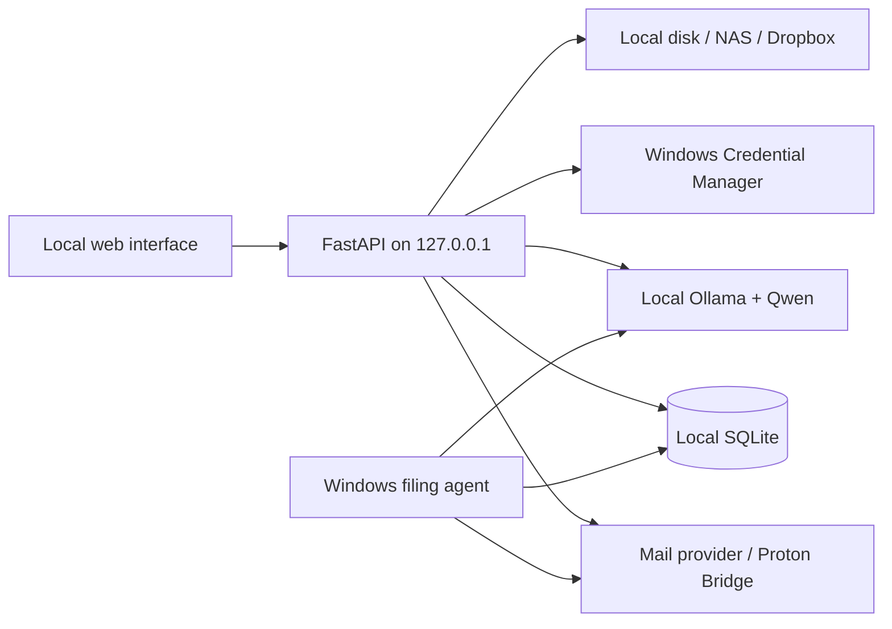

# Local Mail Organizer

> A privacy-first mailbox management workstation powered by local Qwen models.

Local Mail Organizer inventories complete IMAP mailboxes, identifies storage and
organization problems, and presents safe, reviewable actions through a local web
interface. Mail content is processed on the computer running the application;
credentials are kept in the operating-system credential manager.

[](https://www.python.org/)
[](https://nodejs.org/)
[](https://ollama.com/)
[](LICENSE)

## Why this project exists

Large mailboxes usually contain several different problems at once: newsletters,
promotional mail, forgotten attachments, duplicate notifications, poorly organized
records, suspicious messages, and years of low-value automated traffic. Most cleanup
tools require sending mailbox data to a cloud service. Local Mail Organizer provides
one local control surface for these tasks while keeping destructive decisions under
human control.

## Highlights

| Area | Capabilities |
| --- | --- |
| Complete inventory | Resumable scan of every selectable IMAP folder, not only recent messages |
| Storage cleanup | Largest-message view, sender totals, Sent-mail inspection, Local/NAS and Dropbox export |
| Newsletter control | RFC 8058 one-click, mail-based unsubscribe, manual fallback, grouped cleanup |
| AI cleanup | Qwen-assisted review of accumulated non-newsletter mail with deterministic protection rules |
| Organization | Suggested folders, year-based filing plans, saved rules, and a Windows background agent |
| Security | Authentication-signal checks, sender/brand inconsistencies, phishing review, and Qwen second opinions |
| Search | Strict local full-text index with Qwen reranking; irrelevant guesses are rejected |
| Documents | Attachment inventory, duplicate hashes, local PDF extraction, and Qwen Vision OCR |
| Operations | Multi-account isolation, audit history, undo metadata, protection rules, and mailbox health |
| Interface | Responsive local web application, sortable/filterable tables, automatic and manual dark mode |

## Safety model

The application intentionally separates analysis from mailbox mutation.

- Scans use IMAP `BODY.PEEK` and do not mark messages as read.
- Qwen recommendations are advisory and cannot change a mailbox by themselves.
- Finance, legal, security, personal, order, and travel messages receive deterministic
  protection before AI recommendations are considered.
- Low-confidence decisions require review.
- Normal delete actions move messages to the provider's Trash folder.
- Permanent deletion exists only in the dedicated **Empty Trash** flow and requires a
  typed confirmation.
- Archive exports are verified before the mailbox copy can be moved.
- Accounts, scan data, AI results, content indexes, logs, exports, and credentials are
  excluded from Git.

## Architecture



The frontend runs on `http://localhost:3000`. The Python API binds only to
`127.0.0.1:8765`. SQLite data and logs live under `data/` and are not committed.

## Requirements

### Required software

- Windows 10 or Windows 11
- [Git](https://git-scm.com/download/win)
- [Python 3.11 or newer](https://www.python.org/downloads/windows/), including the
  Windows `py` launcher
- [Node.js 22.13 or newer](https://nodejs.org/)
- [Ollama for Windows](https://ollama.com/download/windows)

### Recommended hardware

- 16 GB system memory minimum; 32 GB recommended for larger mailboxes
- An NVIDIA GPU with sufficient VRAM for the selected model is strongly recommended
- Enough local disk space for the ignored SQLite index and optional EML archives

The default models are:

```powershell
ollama pull qwen3.5:9b
ollama pull qwen2.5vl:7b
```

`qwen3.5:9b` handles classification, search reranking, cleanup review, and filing.
`qwen2.5vl:7b` is used only for selected image and scanned-PDF OCR tasks.

## Installation

Clone the repository and run the installer once:

```powershell
git clone <repository-url>
cd local-mail-organizer
Set-ExecutionPolicy -Scope Process Bypass
.\scripts\install.ps1
```

The installer creates `.venv`, installs the Python package, installs frontend
dependencies, and copies `.env.example` to the local `.env` file. It never asks for
or stores a mailbox password.

## One-command start

After installation, start both the API and web interface with:

```powershell
.\Start-MailOrganizer.ps1
```

The launcher:

1. checks the Python environment and frontend dependencies;
2. detects occupied ports before starting anything;
3. starts the API and web interface in hidden background processes;
4. waits until both services are healthy;
5. writes local logs under `data/`; and
6. opens `http://localhost:3000` in the default browser.

Stop both services with:

```powershell
.\Stop-MailOrganizer.ps1
```

To start without opening a browser:

```powershell
.\scripts\start_local.ps1 -NoBrowser
```

## First-run workflow

1. Open **Connect account** and select a provider.
2. Follow the provider-specific instructions shown in the application.
3. Test the encrypted connection and save the credential in Windows Credential
   Manager.
4. Run a **Full mailbox scan**. Large mailboxes are processed in resumable batches.
5. Review the generated workspaces before applying any action.
6. Configure Local/NAS or Dropbox archive storage before using export-and-cleanup.
7. Optionally approve filing rules and install the Windows automation agent.

## Supported providers

| Provider | Authentication |
| --- | --- |
| WEB.DE | Mailbox password; IMAP must be enabled |
| GMX | Mailbox password; IMAP must be enabled |
| Gmail / Google Workspace | App password and two-step verification |
| Yahoo Mail | App password |
| iCloud Mail | Apple app-specific password |
| AOL Mail | App password |
| Fastmail | Mail app password |
| mailbox.org | Mailbox password |
| Posteo | Mailbox password |
| Zoho Mail | Password or app password when MFA is enabled |
| Telekom / T-Online | Separate email password |
| Outlook.com / Hotmail / Microsoft 365 | Microsoft OAuth2 device flow |
| Proton Mail | Local Proton Mail Bridge credentials |

Every account has an opaque local identifier and separate scans, rules, archives,
AI feedback, and audit history.

### Outlook OAuth setup

Microsoft no longer supports normal password authentication for this use case. Create
a Microsoft Entra public-client application, enable device-code flow, and grant these
delegated permissions:

- `IMAP.AccessAsUser.All`
- `SMTP.Send`

Enter the application client ID in the setup screen. Use tenant `common` for personal
Outlook.com and Hotmail accounts. The encrypted MSAL token cache is stored in Windows
Credential Manager and refreshed automatically.

### Proton Mail setup

Proton requires a paid plan and the desktop Proton Mail Bridge. Keep Bridge running,
select STARTTLS mode, and enter the IMAP username, password, and ports displayed by
Bridge. Do not enter the Proton web-login password. Self-signed Bridge certificates
are accepted only on the local loopback interface.

## Archive destinations

### Local disk or NAS

Enter an absolute Windows path such as `D:\MailArchive` or a UNC path such as
`\\NAS\MailArchive`. The application performs a write/read/hash verification before
saving the destination.

### Dropbox

Create a scoped Dropbox app with `files.content.read` and `files.content.write`, then
register this redirect URI:

```text
http://127.0.0.1:8765/api/archive/dropbox/callback
```

Enter the Dropbox app key under **Archive storage**. Authorization uses OAuth2 PKCE
with an offline refresh token stored only in Windows Credential Manager. A test file
is uploaded, downloaded, compared, and removed before Dropbox becomes selectable.

## Local AI behavior

Qwen is used where semantic understanding adds value, but deterministic evidence
remains authoritative.

- Authentication results and provider signals outrank model opinions in phishing
  review.
- Search first requires literal local evidence; Qwen may rank candidates but cannot
  invent results.
- Cleanup suggestions carry reasons and confidence and remain reviewable.
- Account-local corrections are retained in the ignored database and improve later
  recommendations.
- OCR is limited to explicitly selected attachments. Text never leaves the local
  Ollama endpoint and never authorizes a mailbox action.

## Automatic filing agent

Approved filing rules can run without keeping the web application open:

```powershell
.\scripts\install_automation.ps1
```

The scheduled task runs in the signed-in Windows user's context so it can access the
credential manager. It checks only new messages, respects per-account learning mode,
pause state, schedules and action limits, and moves only high-confidence matches.

Remove it without deleting rules or history:

```powershell
.\scripts\uninstall_automation.ps1
```

## Configuration

Safe defaults are documented in `.env.example`. Common settings include:

| Variable | Default | Purpose |
| --- | --- | --- |
| `OLLAMA_BASE_URL` | `http://127.0.0.1:11434` | Local Ollama endpoint |
| `OLLAMA_MODEL` | `qwen3.5:9b` | Main language model |
| `OLLAMA_VISION_MODEL` | `qwen2.5vl:7b` | Vision/OCR model |
| `APP_PORT` | `8765` | Local API port |
| `WEB_ORIGIN` | `http://localhost:3000` | Allowed local frontend origin |
| `DATABASE_PATH` | `data/local-mail-organizer.sqlite3` | Ignored local database |
| `FULL_SCAN_BATCH_SIZE` | `100` | Resumable scan batch size |

Never place mailbox passwords, OAuth tokens, personal addresses, or exported messages
in `.env` or another tracked file.

## Troubleshooting

### Port 8765 or 3000 is already in use

Run:

```powershell
.\Stop-MailOrganizer.ps1
```

If the process was not started by the launcher, inspect it before stopping it:

```powershell
Get-NetTCPConnection -State Listen -LocalPort 8765,3000 |
  Select-Object LocalPort,OwningProcess
```

### The page does not open

Check `data/api-error.log` and `data/web-error.log`, then run the launcher again. The
launcher reports which component failed its health check.

### Qwen features are unavailable

Confirm that Ollama is running and the configured models exist:

```powershell
ollama list
```

### A provider rejects the login

Use the provider-specific setup guide shown by the application. App passwords and
Bridge passwords are different from normal web-login passwords.

## Development

Run both services interactively in separate terminals:

```powershell
.\.venv\Scripts\uvicorn.exe mail_organizer.api:app --host 127.0.0.1 --port 8765
npm run dev
```

Quality checks:

```powershell
.\.venv\Scripts\ruff.exe check src tests
.\.venv\Scripts\pytest.exe -q
npm run lint
npm run build
```

## Repository structure

```text
app/                  Local web routes
components/           Shared interface components
src/mail_organizer/   API, IMAP, AI, storage, and safety services
scripts/              Installation, launcher, and automation scripts
tests/                Safety and behavior tests
docs/                 Architecture and security documentation
```

## Privacy and public repositories

The project is designed to be published without personal mailbox data. `.gitignore`
excludes credentials, `.env`, SQLite files, logs, EML/MBOX exports, archives, model
results, and local runtime directories. Review staged changes before every public
push; never add screenshots containing real addresses or message content.

## Project status

The application is under active development. Always keep an independent backup of an
important mailbox, verify provider behavior with a non-critical account first, and
review selections before applying live actions.

## License

Released under the [MIT License](LICENSE).
